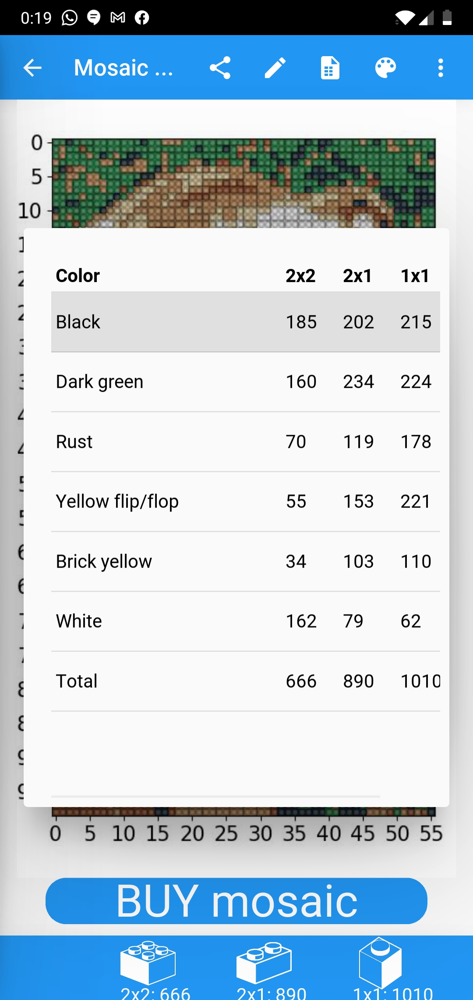

# SmartBricks
=============

Kivy App to convert images into bricks mosaics. The App use three different brick sizes 2x2, 2x1 and 1x1, and the algorith is mart enough to use larger bricks where possible to reduce costs.

## Usage

* Select the image
* Choose Mosaic size (in bricks)
* Choose Mosaic maximum number of colors
* Define a name for your project
* Create the Mosaic

Resulting mosaic will be displayed and you can switch back on to the original image at any time, as well as broke up the mosaic into the different colors. There's also a table where the mosaic is broken into the different mosaic colors and brick sizes.

Snapshots of the home, original image and resulting mosaic are displayed below.

Snapshots of the color palet and mosaic table are below.

## How it works?

In escence, the App follows the next procedure:

1) Took the raw image anad reduce its quality.
2) Then, using K-means, we deconstruct the image to the requested number of colors.
3) After this, original colors are lost, to recover them, we use a KD-three nearest neighbord approximation.
4) Once colors are settle, we proced to the downsized of the image to a pixel size of same lenght as bricks requested.
5 & 6) Last steep messed up with colors, to recover them we repeat steeps 2 and 3.

The following image shows how the above procedure looks like.

Copyright (c) 2020 Omar Ruiz. All rights reserved.
